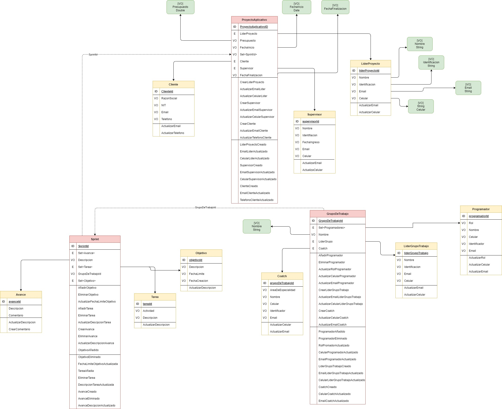

# ddd-ProyectoAplicativo

# Diseño

Use Case/Problem
Con base al conocimiento adquirido sobre DDD poner en evidencia el conocimiento y dominio adquirido de esta temática, para ello realizaremos lo siguiente:

Se debe definir un problema cualquiera sobre el cual se planteara un Modelo de Dominio diferente al Pet Project. De manera individual se dará respuesta a la solución planteada expresada en el Modelo de Dominio y la librería de DDD.

Se deben tener en cuenta la siguientes directrices.

Se debe tener mínimo 2 agregado como mínimo
Se debe tener mínimo 3 entidades como mínimo por cada agregado.
Se debe tener mínimo 12 objetos de valor como mínimo
Se debe tener mínimo 12 comportamientos con sus respectivos eventos de dominio y/o comandos
Se debe tener mínimo 10 casos de uso disparados por comandos
Se debe tener mínimo 2 casos de uso disparados por eventos